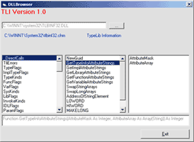



## DLLBrowser

### Description

Browse throught methods, functions, constants, enums, etc of any tlb or ActiveX.dll File via the tlbinf32.dll. Download at www.visualsoft-net.de
 
### More Info
 

             |
---                |---
**Submitted On**   |2004-03-02 16:26:06
**By**             |[Mähr Stefan](https://github.com/Planet-Source-Code/PSCIndex/blob/master/ByAuthor/m-hr-stefan.md)
**Level**          |Advanced
**User Rating**    |4.3 (17 globes from 4 users)
**Compatibility**  |VB 6\.0
**Category**       |[Libraries](https://github.com/Planet-Source-Code/PSCIndex/blob/master/ByCategory/libraries__1-49.md)
**World**          |[Visual Basic](https://github.com/Planet-Source-Code/PSCIndex/blob/master/ByWorld/visual-basic.md)
**Archive File**   |[DLLBrowser171598342004\.zip](https://github.com/Planet-Source-Code/m-hr-stefan-dllbrowser__1-52133/archive/master.zip)

